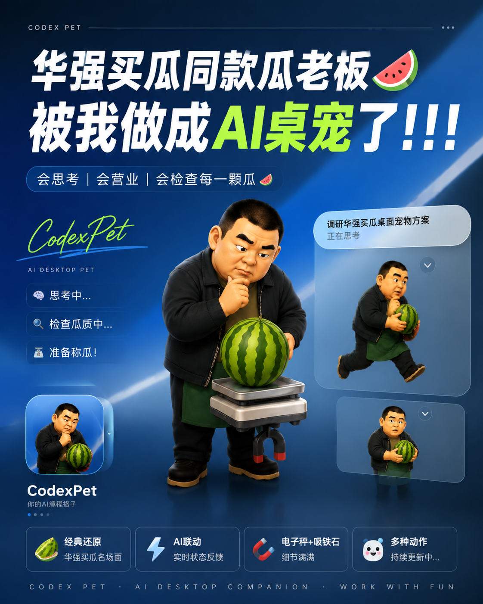

# 瓜老板 Pet

一个来自经典“华强买瓜”名场面的卡通化卖瓜摊主。

他不负责写代码，只负责认真审查每一颗瓜：

> 这瓜保熟吗？

如果不熟，他会当场切开、表情崩掉；  
如果你还没确认，他会抱着西瓜反复敲、侧耳听；  
如果终于确认，他就扛起电子秤，开始严肃称瓜。

## 动作

- `idle`：抱瓜待机，随时准备营业
- `waving`：转身去挑瓜
- `failed`：切开发现生瓜，老板当场破防
- `waiting`：敲瓜、听声，等待确认
- `running`：抱瓜上秤，开始称重
- `review`：贴近西瓜，像代码审查一样严肃复核

## 关于这个 Pet

这是一个受经典网络梗启发的卡通化同人作品，仅用于趣味展示和个人使用，不代表任何官方授权或合作关系。

瓜可以不买，代码不能不上线。
